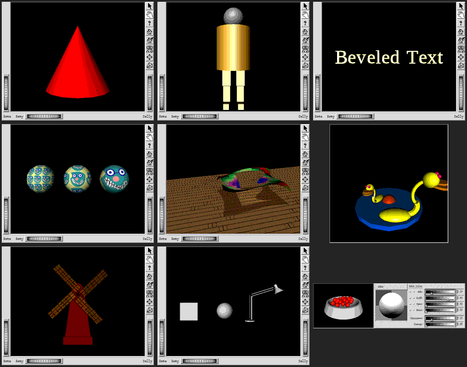

# Open Inventor on libx11-compat

[Open Inventor](https://github.com/aumuell/open-inventor) (SGI's 2.1 scene-graph
toolkit, the codebase behind the *Inventor Mentor* and *Inventor Toolmaker*
books) builds and renders against libx11-compat, including its Motif viewers
(`SoXt`). `mk/open-inventor.mk` drives the build, on Linux with `GLX=1`.

## What it links against

Every X11, Motif and OpenGL dependency comes from this tree; the host only
supplies libjpeg, freetype, iconv and the Mesa/GLVND runtime:

| Open Inventor needs | Provided by |
|---|---|
| Xlib, Xt | `libX11-compat`, `libXt-compat` |
| XInput (`SoXtSpaceball`) | `libXi-compat` (`compat/xi-compat.c`): reports no extra devices |
| Motif (`SoXt` viewers, editors) | the in-tree Motif build (`mk/motif.mk`), not a system `libXm` |
| GLX | `libx11-compat` (`src/glx.c`), including the pbuffer-backed `glXCreateGLXPixmap` used by `SoOffscreenRenderer` |
| OpenGL | GLVND's gl-only `libOpenGL`, dispatching to the Mesa desktop compatibility context libx11-compat creates on EGL (the direct path, no gl4es) |
| GLU (tessellator, NURBS) | [mesa/glu](https://gitlab.freedesktop.org/mesa/glu) 9.0.3, compiled here against `libOpenGL` |

Open Inventor's CMake build finds its dependencies with `find_package()`, which
searches the host first. `scripts/open-inventor-cache.cmake` (passed with
`cmake -C`) pins each X11/Motif/OpenGL result to the in-tree library and points
the include directories at a staged sysroot (`build/open-inventor/sysroot`,
which holds `X11/`, `Xm/` and `GL/`). `check-open-inventor` then resolves the
dependencies of `libInventor`, `libInventorXt` and two examples with `ldd`. It
fails if any X11, Motif or GLU library resolves outside `build/`, or if
`libGL.so` or `libGLX` appears at all. `libGL.so` is excluded because it carries
GLVND's own `glX*`, which would shadow libx11-compat's.

## Build and run

Host packages (Debian/Ubuntu): the Motif chain (`autoconf automake libtool bison
flex`), plus `cmake g++ libjpeg-dev libfreetype-dev libopengl-dev libegl-dev
libgl1-mesa-dri fontconfig`, and `xvfb` for headless runs.

```sh
make GLX=1 open-inventor                     # Motif, GLU, Open Inventor + examples
scripts/run-open-inventor.sh                 # list the built programs
scripts/run-open-inventor.sh 02.4.Examiner   # open a Mentor example on screen
scripts/run-open-inventor.sh 02.4.Examiner --snapshot out.png   # headless
make GLX=1 check-open-inventor               # link audit + headless renders
```

Open Inventor's font library opens fonts by PostScript-style name
(`Times-Roman`, `Helvetica-Bold`, the `Utopia-Regular` fallback, ...) under
`FL_FONT_PATH`, and no package installs files under those names.
`make open-inventor` therefore links each name to the closest host font
(`fc-match`) in `build/open-inventor/fonts`, and `run-open-inventor.sh` points
`FL_FONT_PATH` there. Without it, `SoText2`/`SoText3` draw nothing.

`run-open-inventor.sh` selects GLVND's `libEGL.so.1` as the EGL provider
(`LIBX11_COMPAT_EGL`). GLVND has to be the provider: the `gl*` from `libOpenGL`
only reach the context when GLVND's libEGL made it current. Headless snapshots
also default to `EGL_PLATFORM=surfaceless`.

## Your own programs

Drop a source file in `examples/inventor/` and build it with the same headers,
flags and libraries as the Mentor examples:

```sh
cp my-scene.c++ examples/inventor/
make GLX=1 open-inventor-examples            # builds build/open-inventor/examples/my-scene
scripts/run-open-inventor.sh my-scene
```

`examples/inventor/inventor-shapes.c++` is a small starting point: three lit
shapes on a turntable in an `SoXtExaminerViewer`. The default language mode is
`-std=c++98`, matching Open Inventor's own build; set `OI_USER_STD=c++11` (or
later) for newer code.

Write programs against the SGI Open Inventor 2.1 API with the `SoXt` (Motif)
component library. Code written for Coin3D's extensions, or for `SoQt`,
`SoWin` or `SoGtk`, needs porting first.

## Patches

`compat/open-inventor-patches/` holds four small changes, applied on checkout:

1. `0001` adds `#include <GL/gl.h>` next to `#include <GL/glx.h>` in the
   headers that relied on Mesa's `glx.h` pulling in `gl.h`. libx11-compat's
   `GL/glx.h` deliberately does not, so GLES clients need no desktop GL headers.
2. `0002` makes `SoXt` draw new scenes through the back buffer by default. On an
   expose it drew the first frame straight to `GL_FRONT` and only `glFlush`ed
   it, a workaround for old SGI hardware. libx11-compat composites a window when
   it is swapped, so that frame stayed black.
   `setDrawToFrontBufferEnable(TRUE)` still restores the old behavior.
3. `0003` makes the examples read their `.iv`/`.rgb` data from the source tree
   instead of a hard-coded `/usr/share/src/Inventor/examples/data`.
4. `0004` fixes a 64-bit bug in `libimage`, the SGI `.rgb` reader behind
   `SoTexture2`. The on-disk header fields and RLE row tables are 32-bit, but
   were declared `long`. On LP64 that overran the heap: a textured scene
   aborted with "double free or corruption", or drew nothing. Unrelated to
   libx11-compat, but every texture example depends on it.

Two compat-layer changes came out of the port and help any GLX client:
`glXChooseVisual` now rejects a non-zero `GLX_LEVEL` (there are no overlay
planes; `SoXt` used to get an opaque overlay window composited over its scene),
and `glXCreateGLXPixmap` exists.

## Status: Mentor examples

All 66 *Inventor Mentor* C++ examples build, and 54 of them render headless.
That was checked with `scripts/run-open-inventor.sh <name> --snapshot`,
`assert-image-content.py --region` on the GL canvas, and a visual check of every
capture. The renders cover the examiner and render-area viewers, materials and
lights, 2D/3D/beveled text, textures, NURBS curves and trimmed surfaces,
engines and sensors, picking, manipulators, draggers, the Motif material editor
and GL callbacks.

The other 12:

| Example | Why no frame was captured |
|---|---|
| `03.3.Naming`, `09.3.Search`, `09.5.GenSph`, `12.2.NodeSensor` | console programs, no window |
| `05.5.Binding`, `09.1.Print`, `12.1.FieldSensor`, `12.4.TimerSensor` | need command-line arguments |
| `10.2.setEventCB` | empty until points are added with the mouse |
| `17.3.GLFloor` | renders and swaps, but then `sleep()`s without calling Xlib, so the replay-driven snapshot never fires |
| `16.1.Overlay`, `17.1.ColorIndex` | need overlay planes / a color-index visual (see below) |

`check-open-inventor` keeps `02.1.HelloCone` (`SoXtRenderArea`) and
`02.4.Examiner` (`SoXtExaminerViewer` with its Motif decorations) as the CI
render gate.



## Limitations

- Linux + Mesa only: the direct path needs GLVND `libOpenGL` and Mesa's desktop
  GL over EGL. On macOS the gl4es/ANGLE path would be needed instead (not wired
  up).
- A frame is shown when it is swapped. Single-buffered rendering, or front-buffer
  drawing that only calls `glFlush`, does not reach the screen until the next
  swap.
- No overlay planes and no color-index visuals, so `SoXt` overlay scene graphs
  and color-index rendering (Mentor `16.1.Overlay`, `17.1.ColorIndex`) are not
  drawn.
- Spaceball and dial-box input devices report as absent.

## Roadmap: one SDL3 GL backend for Linux, macOS and Windows

The direct path is not Linux-specific. On every platform the application's
`gl*` can go straight to the native desktop OpenGL; the GLX layer only has to
create contexts, bind drawables and present. Only the plumbing differs:

| | Linux (done) | macOS | Windows |
|---|---|---|---|
| context | EGL (Mesa) | CGL | WGL |
| client links `gl*` from | `libOpenGL` (GLVND) | `OpenGL.framework` | `opengl32.dll` |
| legacy GL 1.x | Mesa compatibility profile | legacy 2.1 profile | driver compatibility profile |
| GLU | built in-tree | `OpenGL.framework` | `glu32.dll` |

SDL3 already wraps all three (`SDL_GL_*`: WGL, CGL, EGL), including the
compatibility profile (`SDL_GL_CONTEXT_PROFILE_COMPATIBILITY`, which is the
legacy 2.1 profile on macOS). One GLX backend on SDL3 can therefore replace
per-OS backends:

| GLX | SDL3 |
|---|---|
| `glXChooseVisual` / FBConfigs | `SDL_GL_SetAttribute` (sizes, double buffer, profile) |
| `glXCreateContext` (+ share list) | `SDL_GL_CreateContext` (`SDL_GL_SHARE_WITH_CURRENT_CONTEXT`) |
| `glXMakeCurrent` | `SDL_GL_MakeCurrent` |
| `glXSwapBuffers` | `SDL_GL_SwapWindow` |
| `glXGetProcAddress` | `SDL_GL_GetProcAddress` |

**GL subwindows as native children.** libx11-compat gives an SDL window only to
top-level and override-redirect X windows (`realizeTopLevelWindow` in
`src/window.c`). Motif menus and dialogs are therefore already separate OS
windows, while child X windows are composited into their top-level. A GL child
window (`GLwDrawingArea`, the `SoXt` render area) instead gets a native child
surface inside its top-level's SDL window:
- an `NSView` subview on macOS;
- a `WS_CHILD` `HWND` on Windows;
- an X11 child window;
- a `wl_subsurface` on Wayland.

That surface is wrapped with `SDL_CreateWindowWithProperties`
(`SDL_PROP_WINDOW_CREATE_COCOA_VIEW_POINTER`, `..._WIN32_HWND_POINTER`,
`..._X11_WINDOW_NUMBER`, `..._WAYLAND_WL_SURFACE_POINTER`, plus the OpenGL
flag), and the context is created on it. That gives:
- a real default framebuffer with front and back buffers, so
  `glDrawBuffer(GL_FRONT/GL_BACK)` and front-buffer frames work, and
  `compat/open-inventor-patches/0002` becomes unnecessary;
- GPU presentation with no per-frame `glReadPixels`;
- HiDPI handled by the OS.

The work:
- keep the native child in step with its X window: geometry on
  `ConfigureNotify`, hidden when it or an ancestor is unmapped, clipped by its
  ancestors;
- make it input-transparent, so pointer and keyboard keep flowing through the
  existing X event path (`hitTest:` returning nil, `HTTRANSPARENT`, an empty
  Wayland input region, an empty X input shape);
- accept that a non-GL X sibling overlapping the GL area is hidden under it
  (rare).

**Headless stays on readback.** With the dummy video driver, or for snapshots,
there is no native surface, so the current offscreen-render-and-composite
path stays as the fallback, as the CI render gates need.

EGL stays for headless Linux (surfaceless Mesa), ANGLE and WebAssembly. The
per-OS sections below keep only what is specific to each platform.

## Roadmap: macOS (native OpenGL through CGL)

The SDL3 GL backend above covers the CGL plumbing; what follows records the
macOS specifics and a CGL-only fallback design. On macOS the GLX layer currently runs on ANGLE: EGL over Metal, GLES only,
with desktop GL translated by gl4es. That suits GL 2.x-style code, but not Open
Inventor, which needs the legacy GL 1.x surface (`GL_SELECT` picking,
`GL_FEEDBACK`, display lists, the attribute stack) that gl4es covers only
partly. macOS still ships a full compatibility OpenGL: Apple's **legacy 2.1
profile**, GPU-accelerated, with GLU in `OpenGL.framework`. It is deprecated
(since 10.14) but present. The target is a **native CGL backend in
`src/glx.c`**, the macOS counterpart of the Linux direct path: no ANGLE, no
gl4es, no Mesa. Clients link `-framework OpenGL` for `gl*`/`glu*`. That
framework exports no `glX*` (unlike XQuartz's `libGL`), so `glX*` keep
resolving to libx11-compat.

### Main path: CGL backend

1. **Make the GLX layer backend-agnostic.** Every EGL call in `src/glx.c` goes
   through the `EglApi` table (`src/egl-wrapper.h`), so it is the natural seam.
   Introduce a small backend interface covering:
   - choosing a config from GLX attributes;
   - querying attributes for `glXGetConfig`/`glXGetFBConfigAttrib`;
   - creating, sharing and destroying contexts;
   - window and offscreen surfaces;
   - make-current, swap, and `glXGetProcAddress`.

   Keep EGL as one implementation and add CGL as the other. Select the backend
   at runtime (e.g. `LIBX11_COMPAT_GLX_BACKEND=cgl|egl`). The default on macOS
   should be CGL once it passes the checks below; ANGLE stays available.
2. **Pixel formats.** Map the GLX visual and FBConfig attributes onto
   `CGLChoosePixelFormat`:
   - `kCGLPFAOpenGLProfile = kCGLOGLPVersion_Legacy`;
   - color, depth and stencil sizes, double buffering, accumulation;
   - `kCGLPFAAccelerated`, falling back to Apple's software renderer
     (`kCGLRendererGenericFloatID`) where no GPU is available, as on CI
     runners.

   The lazy-visual scheme of `glXChooseVisual` carries over unchanged. Keep
   rejecting overlay levels and color-index visuals.
3. **Contexts.** `CGLCreateContext` with share groups for share lists,
   `CGLSetCurrentContext` for make-current, and per-thread current state as
   today.
4. **Drawables: keep real window-system framebuffer semantics.** Legacy code
   calls `glDrawBuffer(GL_BACK)`/`GL_FRONT` and `glReadBuffer`, which fail with
   an FBO bound, so the drawable must be a real default framebuffer:
   - *top-level GL windows*: attach the context to the SDL window's `NSView`
     (`NSOpenGLContext`/CGL surface, `wantsBestResolutionOpenGLSurface = NO`
     to keep the 1:1 point mapping the Metal path pins today). Present with
     `CGLFlushDrawable`; this replaces the `CAMetalLayer` surface.
   - *child GL widgets* (`GLwDrawingArea`, the `SoXt` render area inside its
     Motif frame) and *headless runs*: an offscreen drawable with a true
     front/back pair (a `CGLPBufferObj`, deprecated but working, or an
     IOSurface-backed context), read back with `glReadPixels` and handed to the
     existing compositor (`glxCompositeToWindow`), exactly like the EGL pbuffer
     path. `glXCreateGLXPixmap`/`glXCreatePbuffer` map onto the same object.
   - this would also make front-buffer drawing visible (flush, then composite),
     so `compat/open-inventor-patches/0002` could become unnecessary on this
     backend.
5. **Build and link.** Compile with `-DGL_SILENCE_DEPRECATION` and link the
   GLX layer against `OpenGL.framework`. `mk/open-inventor.mk` gains a Darwin
   branch: the cache script points `OPENGL_*` at the framework and
   `OPENGL_glu_LIBRARY` at its GLU, so the in-tree mesa/glu is not needed.
   Motif already builds on macOS (the paperplane path).
6. **Validation.**
   - `tests/test-glx-direct.c` runs unchanged on macOS, linked with
     `-framework OpenGL`; `GL_VERSION` must report the legacy 2.1 profile, and
     `GL_SELECT`, feedback, display lists, the attribute stack and GLXPixmap
     must all pass.
   - `check-open-inventor` swaps `ldd` for `otool -L`: no XQuartz
     (`/opt/X11`), no Homebrew `libGL`, and `libXm`/`libXt`/`libX11` must come
     from `build/`.
   - The Mentor sweep must match the Linux result (54/66).
   - Run all of it in the macOS CI job.

Risks: Apple could remove OpenGL in a future macOS (the ANGLE path then
remains the fallback), and the legacy profile is frozen at 2.1, which is ample
for Open Inventor-era code.

### Secondary path: Homebrew Mesa

The Linux direct path ports almost as is to macOS with Homebrew Mesa: EGL in
surfaceless mode and llvmpipe, i.e. a real compatibility profile rendered on
the CPU. Homebrew's `libGL` is monolithic, exporting both `gl*` and `glX*`, so
clients must link through the gl-only re-export shim `mk/motif.mk` already
builds for paperplane (`MOTIF_GLSHIM_DIR`). That keeps `glX*` on
libx11-compat. It is a quick way to get Open Inventor running on macOS, and a
CPU reference to compare the CGL backend against, but it is not the target: no
GPU, and an extra Homebrew dependency.

## Roadmap: Windows

The longer-term goal is to run the same old X11/Motif and Open Inventor
applications natively on Windows, with SDL3 as the window and input backend.
Their original sources would need only minimal porting, without a Windows
component library (`SoWin`, or Coin3D's) and with `SoXt` kept as it is. None of
this exists yet. The work, in order:

1. **libx11-compat on MinGW-w64, `SDL_BACKEND=sdl3`.** About 27 files in `src/`
   and `compat/` use POSIX APIs: `pthread` (winpthreads or Win32 threads),
   `dlopen`/`dlsym` (`LoadLibrary`/`GetProcAddress`, also for the EGL loader),
   and `poll`/`select`/`unistd` in the event loop. Produce DLLs plus import
   libraries, and gate the work with a cross-compiled build in CI, run under
   Wine.
2. **A GLX provider on Windows.** The Linux direct path (GLVND `libOpenGL` +
   Mesa EGL) has no Windows counterpart. Candidates:
   - Mesa for Windows (llvmpipe/d3d12) exposing desktop GL through EGL or WGL,
     to keep the legacy GL 1.x surface Open Inventor relies on (`GL_SELECT`,
     feedback, display lists);
   - ANGLE + gl4es, the macOS path (GLES ceiling, see the GLX limitations in
     the README);
   - a WGL backend in `src/glx.c`, with SDL3 owning the window.
3. **Motif (libXm/libMrm) and libXt-compat under MinGW** (autotools in an
   MSYS2 environment, or a CMake/Make rewrite of the build).
4. **Open Inventor**: `libimage`, `libFL` (FreeType and the font directory),
   `libInventor` and `libSoXt`, then the Mentor examples. Validate with the
   same `check-open-inventor` link audit (resolving DLLs instead of `ldd`) and
   headless renders.
